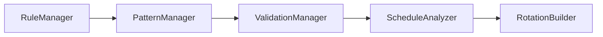

# Radio Rotation System Test Coverage Matrix

## Matrix Legend
- **U**: Unit Test Required
- **I**: Integration Test Required
- **S**: System Test Required
- **P**: Performance Test Required
- ➡️: Dependencies flow right

| Criteria ID | Description | Unit | Integration | System | Performance | Primary Test Location |
|------------|-------------|:----:|:-----------:|:------:|:-----------:|----------------------|
| **1. Core Functionality** |
| 1.1.1 | Rotation Validation | U | I | S | - | ValidationManager.test.ts |
| 1.1.2 | Violation Reporting | U | I | - | - | ValidationManager.test.ts |
| 1.1.3 | Resolution Suggestions | U | - | S | - | ScheduleAnalyzer.test.ts |
| | | | | | |
| 1.2.1 | Core Category Count | U | - | - | - | ValidationManager.test.ts |
| 1.2.2 | Gold/Modern Balance | U | I | - | - | ValidationManager.test.ts |
| 1.2.3 | Specialty Requirements | U | - | S | - | ValidationManager.test.ts |
| | | | | | |
| 1.3.1 | Pattern I Rules | U | - | - | - | PatternManager.test.ts |
| 1.3.2 | Set Pattern Combinations | U | I | - | - | PatternManager.test.ts |
| 1.3.3 | Third Set Structure | U | I | S | - | PatternManager.test.ts |
| | | | | | |
| 1.4.1 | Commercial Break Patterns | U | - | - | - | PatternManager.test.ts |
| 1.4.2 | Break Length Rules | U | I | - | - | PatternManager.test.ts |
| | | | | | |
| **2. Rule Enforcement** |
| 2.1.1 | Category Placement Rules | U | I | S | - | ValidationManager.test.ts |
| 2.1.2 | Category Spacing Rules | U | I | - | - | ValidationManager.test.ts |
| 2.1.3 | Post-Jingle Rules | U | - | - | - | ValidationManager.test.ts |
| | | | | | |
| 2.2.1 | Set Structure Rules | U | I | S | - | ValidationManager.test.ts |
| 2.2.2 | Commercial Break Placement | U | I | - | - | PatternManager.test.ts |
| | | | | | |
| **3. Analysis** |
| 3.1.1 | Priority-Ordered Violations | U | - | S | - | ScheduleAnalyzer.test.ts |
| 3.1.2 | Rule Reference Clarity | U | - | - | - | ScheduleAnalyzer.test.ts |
| 3.1.3 | Resolution Steps | U | I | S | - | ScheduleAnalyzer.test.ts |
| | | | | | |
| 3.2.1 | Position Options | U | I | - | - | ScheduleAnalyzer.test.ts |
| 3.2.2 | Rule Impact Analysis | U | I | - | - | ScheduleAnalyzer.test.ts |
| | | | | | |
| **4. User Interaction** |
| 4.1.1 | Error Message Clarity | U | - | S | - | All test files |
| 4.1.2 | Error Resolution Guidance | U | - | S | - | All test files |
| | | | | | |
| 4.2.1 | Modification Steps | U | I | S | - | RotationBuilder.test.ts |
| 4.2.2 | Change Impact Analysis | U | I | - | - | RotationBuilder.test.ts |
| | | | | | |
| **5. Performance** |
| 5.1.1 | Basic Validation Speed | - | - | - | P | performance.test.ts |
| 5.1.2 | Full Analysis Speed | - | - | - | P | performance.test.ts |
| 5.1.3 | Caching Effectiveness | U | I | - | P | performance.test.ts |
| | | | | | |
| **6. Integration** |
| 6.1.1 | Database Operations | - | I | S | - | integration/database.test.ts |
| 6.1.2 | Data Consistency | - | I | S | - | integration/database.test.ts |
| | | | | | |
| 6.2.1 | CLI Operation | - | - | S | - | integration/cli.test.ts |
| 6.2.2 | Output Formatting | U | - | S | - | integration/cli.test.ts |

## Test Type Definitions

### Unit Tests (U)
- Test individual components in isolation
- Mock dependencies
- Focus on single responsibility
- Quick execution

### Integration Tests (I)
- Test component interactions
- Use test database
- Verify proper data flow
- Test error propagation

### System Tests (S)
- Test complete workflows
- Use production-like data
- Verify end-to-end functionality
- Test CLI interface

### Performance Tests (P)
- Measure response times
- Test under load
- Verify caching
- Check resource usage

## Dependencies

